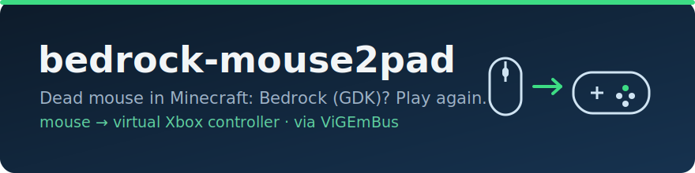

<p align="center">
  
</p>

# bedrock-mouse2pad

**Minecraft: Bedrock Edition (Windows GDK build) killed your mouse in-game? This gets you playing again.**

If your keyboard works, your controller works, but **mouse camera-look and left/right/middle clicks do nothing inside Minecraft** — while the cursor still moves fine on your desktop and in every other game — this tool is for you. It turns your mouse into a virtual Xbox controller that Minecraft *does* listen to.

> ⚠️ This is a **workaround for a Mojang bug**, not an official fix. It's a bridge until Mojang patches the GDK mouse input path. See [Honest caveats](#honest-caveats).

---

## The problem

Starting with the **GDK builds of Minecraft Bedrock (1.21.120+)** on Windows 10/11, some players lose all mouse input *inside the game*:

- ❌ Moving the mouse doesn't move the camera.
- ❌ Left / right / middle click do nothing (mining, placing, menus).
- ✅ The Windows cursor still moves normally.
- ✅ Keyboard works. ✅ A game controller works perfectly.
- ✅ The mouse works flawlessly in **every other game and app**.

And it **survives everything you'd normally try**:

- Reinstalling Minecraft, resetting `options.txt`, Windows "Repair" / "Reset" on the app
- Toggling **Raw Input** in the game's settings
- A **different / second mouse** (so it's not your hardware)
- **Single monitor** vs multi-monitor
- Closing **Logitech G Hub**, KVM software, or other input utilities
- **Cursor-confinement** tools (they fix *cursor escaping*, not *dead input*)

That's because the bug is in Minecraft's **client-side mouse input path** on GDK — nothing on your PC is at fault.

## Why this works

Minecraft's **controller** input path is completely healthy — only the mouse path is broken. So instead of fighting the mouse path, this tool:

1. Installs a **virtual Xbox 360 controller** using the signed **ViGEmBus** driver.
2. Reads your **real mouse at the device level** (Raw Input) and **translates** it into that virtual controller — mouse movement becomes the right stick, clicks become the triggers, etc.
3. Does this **only while Minecraft is the focused window**, and only while Minecraft is running.

Minecraft sees "a controller," and responds normally. You play with your mouse.

## What it does / doesn't touch

- ✅ Your mouse is only **read**, never modified or blocked — it stays 100% normal everywhere else.
- ✅ The virtual controller **exists only while `Minecraft.Windows.exe` is running**, and is unplugged the instant it closes. No virtual pad lingers while you play other games.
- ✅ Translation is **paused whenever Minecraft isn't focused** — Alt-Tab and your mouse is a normal mouse again.
- ✅ Your **real controller keeps working** and coexists (a family member can still grab the Xbox pad).
- ✅ No kernel hooks on your mouse, no filter drivers, no changes to Minecraft's files.

---

## Requirements

- Windows 10 or 11 (x64)
- [Python 3](https://www.python.org/downloads/) (tick **"Add python.exe to PATH"** during install)
- Admin rights **once**, only for the first-time ViGEmBus driver install (then a reboot)

## Install

**Easiest (no PowerShell needed):** on this page click the green **`< > Code` ▸ Download ZIP**, extract it, then **double-click `install.bat`**. Approve the admin / "ViGEmBus Setup" prompts if they appear.

Prefer PowerShell? From the extracted folder:

```powershell
powershell -NoProfile -ExecutionPolicy Bypass -File .\install.ps1
```

The installer will:
1. Find Python.
2. `pip install vgamepad` — this **bundles the ViGEmBus driver installer**. Accept the UAC / "ViGEmBus Setup" prompt if it appears.
3. Copy files to `%LOCALAPPDATA%\Mouse2PadBedrock`.
4. Register a hidden **`MouseToPad`** scheduled task that runs at logon.
5. Start it and verify.

> 🔁 **First install needs a reboot.** ViGEmBus can't connect a virtual pad until Windows restarts once after the driver is installed. Reboot, then just launch Minecraft — the helper is already running in the background.

## Uninstall

```powershell
powershell -NoProfile -ExecutionPolicy Bypass -File .\uninstall.ps1
```

Stops the helper (unplugging the pad), removes the task and files, and **asks** before removing the shared ViGEmBus driver (other tools like DS4Windows use it, so it's kept by default).

---

## Controls & mapping

| Your input | Virtual controller | In Minecraft |
|---|---|---|
| Move mouse | Right stick | Look / aim camera |
| Left click | Right trigger | Attack / mine |
| Right click | Left trigger | Use / place / eat |
| Middle click | Y button | *(rebindable — Bedrock has no true "pick block" on a pad)* |
| Scroll up / down | LB / RB | Cycle hotbar |
| **Ctrl + Alt + M** | — | **Pause / resume** translation |

## Configuration

Edit `%LOCALAPPDATA%\Mouse2PadBedrock\mouse2pad_config.txt` — changes apply **live within ~1 second**, no restart:

| Setting | Meaning |
|---|---|
| `sensitivity` | Camera speed. Higher = faster. `0.010` slow … `0.040` fast (default `0.020`). |
| `invert_y` | `0` = mouse up looks up (normal); `1` = inverted. |
| `wheel_pulse_ms` | How long each scroll notch holds LB/RB. |

**Tune the camera:** open the config, change `sensitivity`, save, and feel the difference in-game a second later.

---

## Troubleshooting

**The pad doesn't work right after installing.**
ViGEmBus needs **one reboot** after its first install before any virtual pad can connect. Restart Windows.

**"Python was not found."**
Install [Python 3](https://www.python.org/downloads/) and check **"Add python.exe to PATH"**, then re-run `install.ps1`.

**Nothing happens in-game after reboot.**
- Confirm the helper is running:
  ```powershell
  Get-CimInstance Win32_Process -Filter "Name='pythonw.exe'" | Where-Object { $_.CommandLine -like '*mouse2pad.py*' } | Select-Object ProcessId, CreationDate
  ```
- Confirm the task exists: `Get-ScheduledTask -TaskName MouseToPad`
- Start it manually: `Start-ScheduledTask -TaskName MouseToPad`
- Check `%LOCALAPPDATA%\Mouse2PadBedrock\mouse2pad.log` for errors.

**Camera moves when I'm not touching the mouse.**
It shouldn't (the stick decays to center on stop). Lower `sensitivity` and make sure only one instance is running.

**It's translating when I don't want it to.**
Press **Ctrl + Alt + M** to pause, or Alt-Tab out of Minecraft (translation only runs while Minecraft is focused).

---

## Honest caveats

- **The camera feel is velocity-based, not native 1:1 mouse aim.** A controller stick reports *how far you've pushed it* (a turn speed), while a mouse reports *how far you moved*. This tool maps mouse movement to stick deflection, so aiming feels like a very responsive controller, **not** like raw mouse aim. It's very playable; it is not pixel-perfect FPS aiming.
- **This is a workaround, not a fix.** If your mouse cursor moves on screen but Minecraft Bedrock won't register clicks or camera movement — while keyboard and controller work fine — this tool fixes that. The root cause is a **game-side bug in the GDK builds of Minecraft Bedrock (1.21.120+)**, not anything on your PC. **Uninstall this tool once Mojang patches it.**
- **Tested on:** Windows 11 + Bedrock **1.21.12x** (GDK). Other versions/configs may vary.
- **Use at your own risk.** See the [no-warranty disclaimer](#license--credits).

## Reported environments where this bug appears (and what is *not* the cause)

Players hitting this bug often have one or more of: **multiple monitors**, a **KVM switch**, or **Logitech G Hub** installed. These are **correlations, not causes** — the bug was reproduced and ruled independent of all of them (it happens on a single monitor, with no KVM, and with G Hub closed). **This tool works regardless of whether you have them.** Don't waste time uninstalling G Hub or unplugging monitors expecting a fix.

---

## License & credits

This project is licensed under the **[MIT License](LICENSE)**.

**THE SOFTWARE IS PROVIDED "AS IS", WITHOUT WARRANTY OF ANY KIND.** You install and run it at your own risk.

Built on the excellent work of others (see [THIRD_PARTY_NOTICES.md](THIRD_PARTY_NOTICES.md)):

- **[ViGEmBus](https://github.com/nefarius/ViGEmBus)** — the signed virtual-gamepad kernel driver by **Nefarius Software Solutions e.U.** (BSD-3-Clause). This tool would not exist without it.
- **[vgamepad](https://github.com/yannbouteiller/vgamepad)** — Python bindings for ViGEm by **Yann Bouteiller** (MIT).

Related community work on the GDK cursor/mouse bugs:

- **[SwimMouseCursor](https://github.com/Swedeachu/SwimMouseCursor)** by Swedeachu — cursor confinement for the escaping-cursor variant.
- **[Igneous](https://github.com/Aetopia/Igneous)** by Aetopia — workarounds for various Bedrock GDK bugs.

*Not affiliated with Mojang or Microsoft. Minecraft is a trademark of Mojang Synergies AB.*
